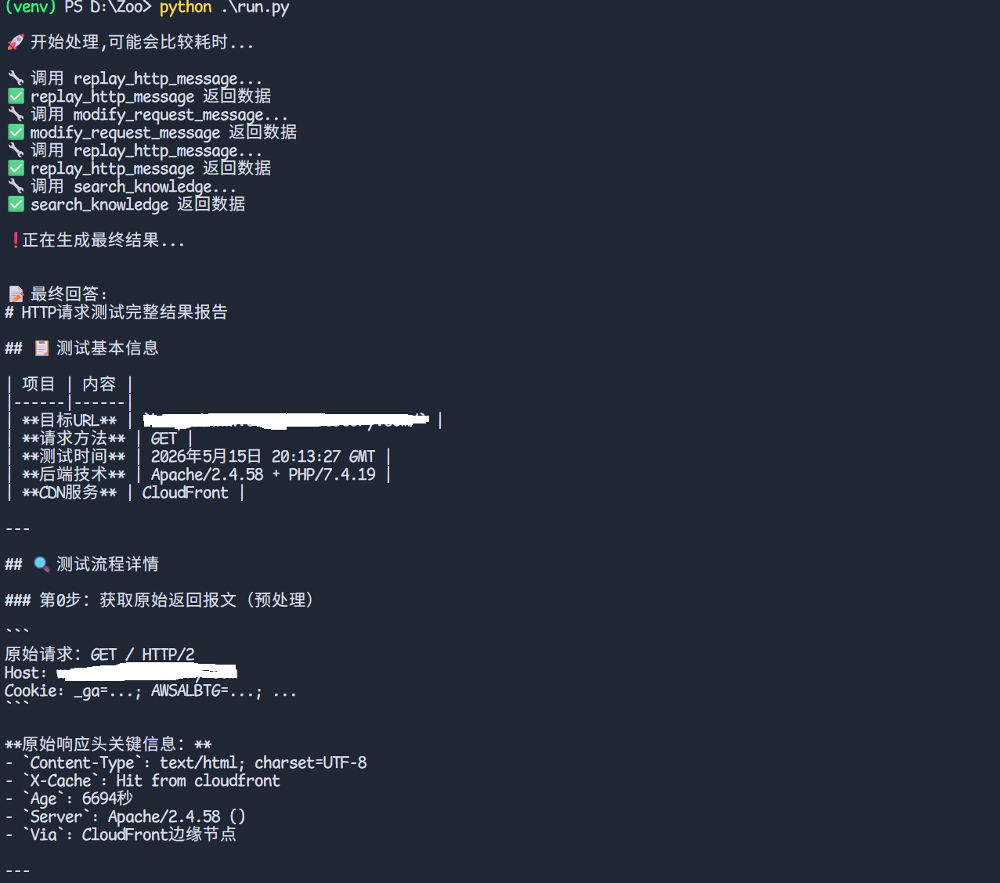

# Dugong

## HTTP RAG Agent

一个基于 LangChain + LangGraph + RAG 的智能 HTTP 报文安全测试 Agent。  
该项目能够自动：

- 修改 HTTP 请求报文
- 重放 HTTP 请求
- 查询知识库
- 基于返回结果进行分析
- 使用 Agent 进行自动化推理与记忆管理

适用于：

- Web 安全测试
- HTTP 报文分析
- RAG 安全知识库问答
- 自动化漏洞验证
- AI 安全 Agent 实验

---

# 项目架构

```text
.
├── run.py
├── rag.py
├── llm.py
├── utils.py
├── prompt.yaml
├── http_request.txt
└── requirements.txt
```

---

# 功能特性

## 1. HTTP 报文修改

Agent 会自动调用：

```python
modify_request_message()
```

用于：

- Payload 注入
- 参数修改
- Header 调整
- 漏洞测试构造

---

## 2. HTTP 请求重放

自动调用：

```python
replay_http_message()
```

实现：

- 请求发送
- 返回包获取
- Header 分析

---

## 3. RAG 知识库查询

通过：

```python
search_knowledge()
```

进行：

- 漏洞知识查询
- Payload 推荐
- Web 安全分析
- 返回结果解释

---

## 4. Agent Memory（短期记忆）

使用：

```python
InMemorySaver()
```

实现：

- 多轮上下文记忆
- 测试状态保持
- 会话连续推理

---

# 技术栈

- Python
- LangChain
- LangGraph
- RAG
- YAML Prompt
- AsyncIO

---

# 安装依赖

```bash
pip install -r requirements.txt
```

---

# 创建向量知识库
```bash
python vector.py ./documents/web_cache_poisoning_cn.md
```

# 配置大模型

在：

```python
.env
```

中初始化你的模型，例如：

```python
API_KEY=YORUR_API_KEY
LLM=YOUR_LLM_MODEL_NAME
EBM=YOUR_LLM_EMBEDDING_MODEL_NAME
```

---

# Prompt 配置

编辑：

```yaml
prompt.yaml
```

示例：

```yaml
system_prompt: |
  你是一名 Web 安全测试专家。

query: |
  根据以下内容查询知识库：

modify_request_message: |
  请修改以下 HTTP 请求用于安全测试：
```

---

# HTTP 请求格式

编辑：

```text
http_request.txt
```

示例：

```http
GET / HTTP/1.1
Host: example.com
User-Agent: Mozilla/5.0
```

---

# 启动项目

运行：

```bash
python run.py
```

---

# 运行流程

```text
读取 HTTP 请求
        ↓
Agent 分析请求
        ↓
修改 HTTP 报文
        ↓
重放 HTTP 请求
        ↓
分析响应结果
        ↓
查询 RAG 知识库
        ↓
输出最终测试结果
```

---

# 核心代码示例

## 创建 Tool

```python
@tool(description="用于查询知识库内容")
def search_knowledge(query: str) -> str:
    ...
```

---

## 创建 Agent

```python
agent = create_agent(
    model=llm,
    tools=[
        modify_request_message,
        replay_http_message,
        search_knowledge
    ],
    system_prompt=system_prompt,
    checkpointer=checkpointer
)
```

---

## 流式输出

```python
async for chunk in agent.astream(...):
```

---

# 项目亮点

- 支持 Tool Calling
- 支持 Agent Memory
- 支持异步流式输出
- 支持 RAG 知识库
- 支持 HTTP 自动化测试
- Prompt 可配置
- 易于扩展

---

# 可扩展方向

## 可增加：

- SQL 注入自动化
- XSS Payload 生成
- SSRF 检测
- BurpSuite 集成
- 向量数据库支持
- 多 Agent 协作
- MCP Server 集成
- 自动漏洞报告生成

---

# 示例输出

```text
🚀 开始处理,可能会比较耗时...

🔧 调用 modify_request_message...
✅ modify_request_message 返回数据

🔧 调用 replay_http_message...
✅ replay_http_message 返回数据

🔧 调用 search_knowledge...
✅ search_knowledge 返回数据

📝 最终回答:
目标存在潜在 SQL 注入漏洞。
```

---

# 安全声明

本项目仅用于：

- 安全研究
- 合法授权测试
- 学术学习

禁止用于：

- 非法攻击
- 未授权渗透
- 恶意用途

---

# License

MIT License

---

# Star History

如果这个项目对你有帮助，欢迎 Star ⭐
